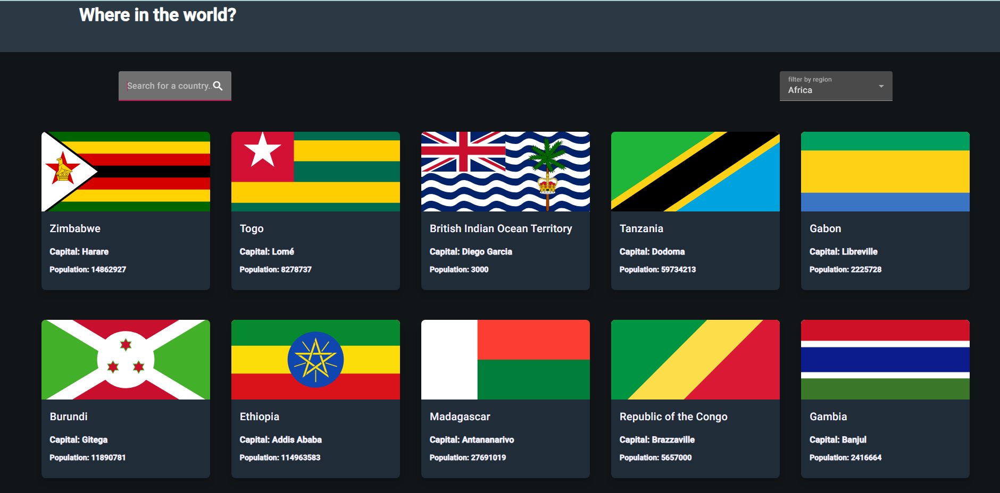

# Country Challenger

<

## ATENÇÃO: `Código Inicial do Desafio `

Se você deseja acessar o repositório vai iniciar o projeto desde o início, você deve fazer um clone da branch `master`. Lá estará presente toda a parte estrutural, as funções .

A versão completa do código encontra-se na branch `master`

## Como iniciar o projeto

Dentro do diretório principal, você pode executar:

### `npm install`

Instala todas as dependências do projeto dentro da pasta "node_modules"

### `npm start`

Inicia a aplicação no modo de desenvolvimento.\
Acesse [http://localhost:4200] para visualizar a página no seu browser.

# Se deseja ver o projeto em deply acesse

https://country-challenge-seven.vercel.app/home

# Se deseja ver o projeto em deply acesse

[Tailwindcss](https://tailwindcss.com/) - Isso me ajudou pois é uma documentação bem detalhada de cada ferramenta do css que eu pude ultilizar . Gostei muito desse padrão e vou usá-lo daqui para frente.
- [Angular Material ](https://material.angular.io/) - Essa biblioteca do angular é  incrível e me ajudou a construir  diversos  recursos da tela, além de ser facil de entender . Eu recomendo para quem está precisando de uma ferramenta  desse conceito.
